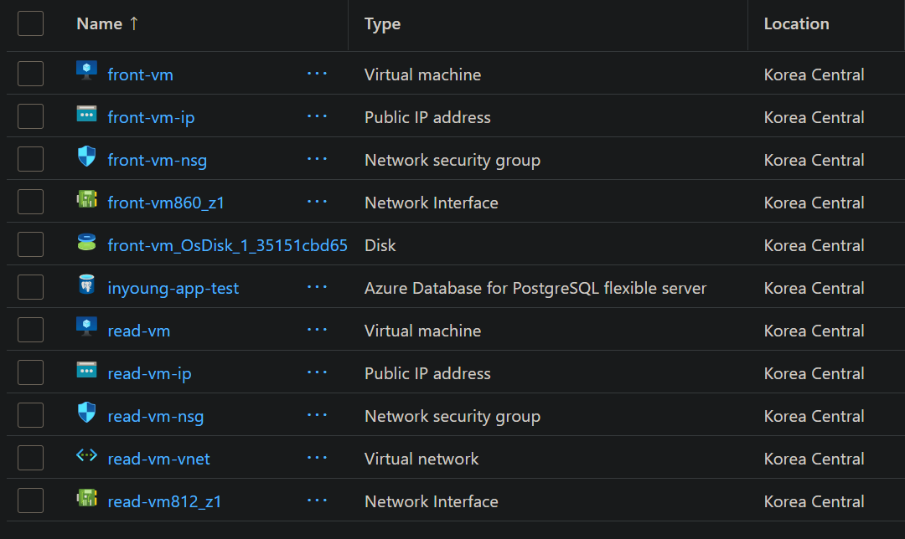
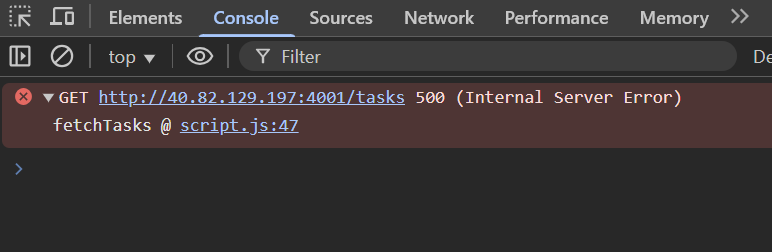
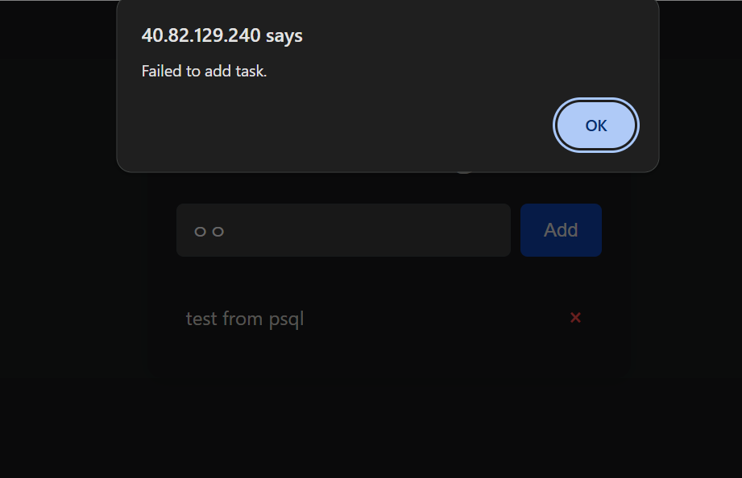
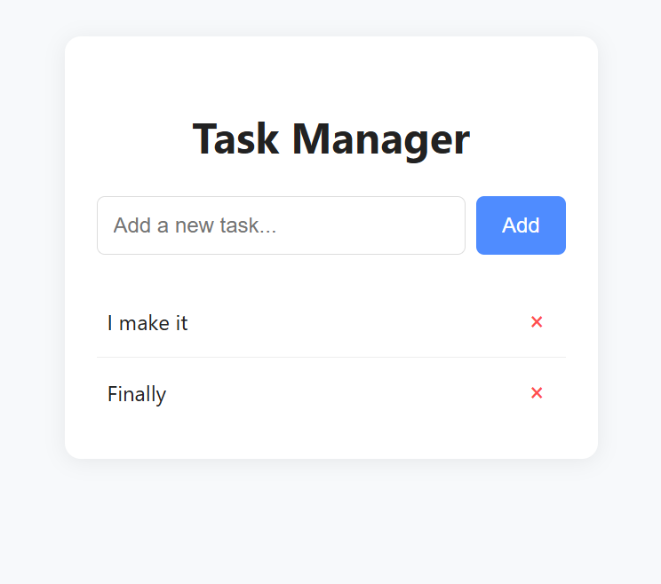

# AI Making Challenge - Day 11

## 💡 Topic : Building and Deploy Application with GitHub Copilot

## 🎯 Objective
While 'Vibe coding' tools like Lovable and Base44 can handle the entire process from app development to deployment using their own integrated backends. I understand that to deploy an application on my own cloud environment, like Azure or on-prem, I need to develop the backend myself.

I want to try deploying an app on Azure myself using a tech stack of Node.js and PostgreSQL. To do this, I plan to use GitHub Copilot to assist with the development and handle the cloud deployment on my own.

## 🤖 AI Tools : [Github Copilot](https://github.com/features/copilot?locale=ko-KR)
GitHub Copilot is an AI-powered pair programmer developed by GitHub and OpenAI that integrates directly into your code editor like Visual Studio Code. It can directly write code within my development environment.

When using tools like ChatGPT or Gemini, I would need to copy and paste the AI-generated code into my IDE.
However, since Copilot is built into the IDE itself, it can understand my ongoing code and project structure in real time, suggest relevant code, and even automatically apply those suggestions directly into my files — which is a major advantage.

## 📊 Results
I'm not a developer, so I can't build even simple web applications. That's why I wanted to create a fully functional app using Vibe Coding. With the help of ChatGPT, I wrote a [prompt](prompts\prompt.md) that included my requirements. I wanted to build a task manager app with two Node.js backend servers and a PostgreSQL database, and I asked GitHub Copilot to generate it for me directly.

Next, I tried deploying this app on Azure. I first provisioned all the necessary resources, including the frontend, two backend VMs, PostgreSQL, and a public IP. Then, I accessed the servers and used scp to transfer my local code, and ran the app.

However, as expected, the app that worked perfectly on my local machine didn’t function properly in the cloud…

I ran into a few errors like the ones below. I copied the error messages directly into Gemini and followed its instructions, which somehow helped me resolve the issues. I would have documented the troubleshooting process
- Error caused by enabling CORS globally

    

- Error caused by issues connecting to the write backend server

    

I entered the error codes into Gemini and wrestled with them diligently, and in the end, I successfully deployed the app!!

I successfully deployed my first app using a frontend, two backend servers (read server and write server), and PostgreSQL. Task creation, deletion, and viewing all worked perfectly. Although it was a very simple app, I felt incredibly proud because it was my first time deploying an app.

## 📝 Reflection
DAY11 felt less like an AI challenge and more like a hands-on app deployment exercise for cloud engineers. While deploying resources like VMs and databases on the cloud, I was curious about how the frontend connects to the backend, how the backend connects to the database, and how multiple backend servers interact with each other. By looking at the code generated by GitHub Copilot, I was able to understand these connections a little better.

Since my role is a cloud engineer, going forward I plan to not only develop AI services and workflows within the platform but also take it a step further by deploying them on the cloud.