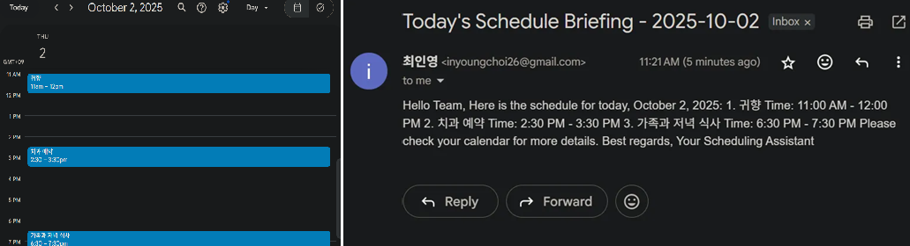

# AI Making Challenge - Day 4

## 💡 Topic : Building an AI agent workflow with n8n

## 🎯 Objective
With the rise of AI and automation tools, I have had several experiences developing workflow-based automation systems. Such tools typically require precise step-by-step instructions from A to Z in order to function correctly. However, if a process changes even slightly, the workflow must be modified, and the lack of flexibility makes it difficult to reuse the same workflow in other tasks.

With the advancement of generative AI, a new concept called the AI Agent has emerged, moving away from the traditional “single input → single output” AI approach. An AI Agent, upon receiving input, can break down tasks into smaller steps, call the necessary tools or APIs, analyze intermediate results, make decisions, and work toward achieving the final goal.

This means that even without highly detailed instructions, an AI Agent can determine the best course of action, ensuring that the automation workflow operates effectively. Inspired by this, I wanted to test whether something similar to Iron Man’s “J.A.R.V.I.S.” assistant could be feasible in practice. To explore this idea, I decided to attempt developing an AI Agent-powered automation workflow using n8n.

## 🤖 AI Tools : [n8n](https://n8n.io/)
n8n is an workflow automation platform. It allows users to connect APIs, databases, and third-party services into automated workflows without needing to wirte a full custom application. Unlike simple ‘trigger-action’ tools, n8n not only supports advanced workflows with branching logic, loops, and custom code, but also leverages AI to build intelligent automations, enabling agent-like behavior that can make decisions and act autonomously.

## 📊 Results

That’s my final AI agent workflow, and the structure is intentionally simple.
The trigger is set to chat, and I’ve integrated the core components the agent needs: the LLM model, memory, Google Calendar, Google Drive, and Gmail.

When I interact through chat, the OpenAI chat model automatically determines which tool to use, where to fetch data from, and what action to perform. It then executes the workflow and produces the result without any manual intervention.

The workflow design and prompting approach were based on Citizen Developer Gu’s resources
- [https://github.com/citizendev9c/yt-assets/tree/main/automation/n8n/first-ai-agent-25-05-03](https://github.com/citizendev9c/yt-assets/tree/main/automation/n8n/first-ai-agent-25-05-03)
- [https://www.youtube.com/watch?v=VlsgHC5xkPA&t=1254s](https://www.youtube.com/watch?v=VlsgHC5xkPA&t=1254s)

## 📝 Reflection
Instead of defining each step of the workflow in detail, I simply connected the tools required for the AI agent. The agent then automatically decided which resources to use and what actions to take, which made the process very convenient. Its flexibility is a major advantage, as a single workflow can handle multiple tasks.

That said, since it’s based on a generative AI model, hallucination issues meant the results weren’t always accurate on the first try, and overall precision was lower compared to traditional workflows.

However, as generative AI continues to advance, I expect the performance of AI agents will also improve significantly.