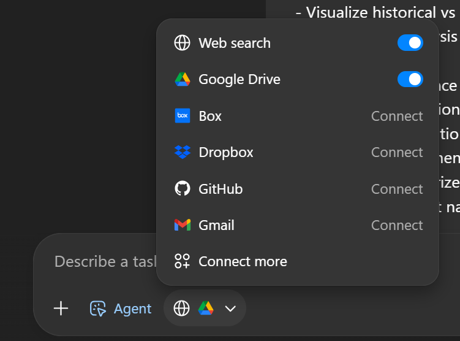
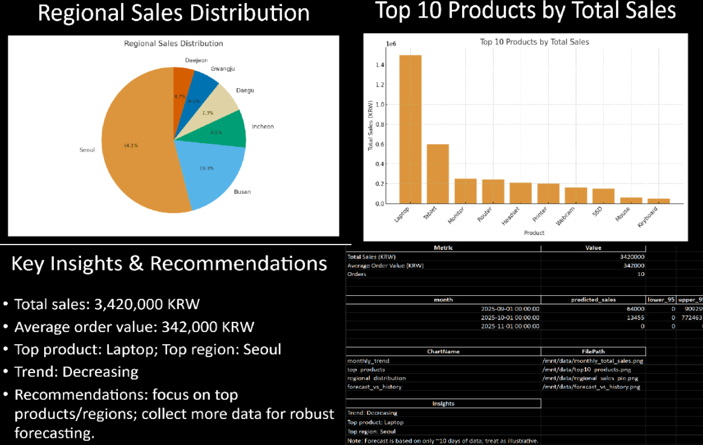
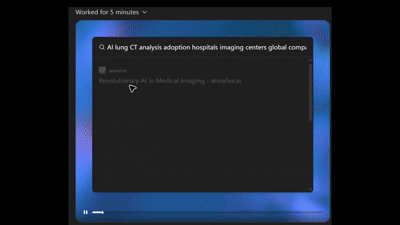
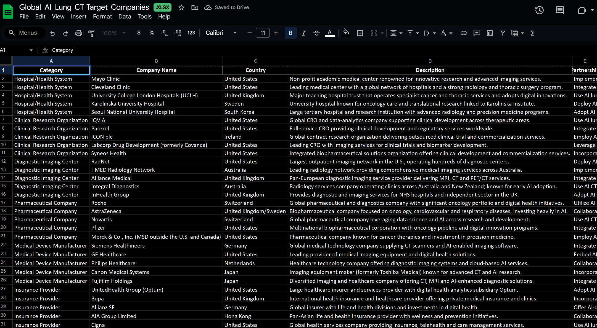

# AI Making Challenge - Day 6

## 💡 Topic : Building AI agent using ChatGPT Agent Mode

## 🎯 Objective
On [Day5](https://github.com/LimitlessDevv/100-Day-AI-Making-Challenge/blob/main/Week1/Day5/Day5.md), I built an AI agent using n8n, an automation workflow tool.

After that, I discovered that ChatGPT Pro also provides an Agent Mode, which allows for the creation of AI agents directly within ChatGPT.

I wanted to explore and compare the differences between ChatGPT’s Agent Mode and the custom AI agent I designed in n8n, particularly in terms of how they’re built, what they can do, and how efficiently they perform.

## 🤖 AI Tools : [ChatGPT Agent Mode](https://chatgpt.com/)

ChatGPT Agent Mode is a proactive operational mode where the model can autonomously take actions or perform tasks on behalf of the user rather than wating for explicit instructions.

It allows ChatGPT to plan, execute, and coordinate multiple steps to achieve a goal, such as retrieving data, running scripts, or managing workflows.

In this mode, the agent can initiate follow-ups or suggest next actions proactively, improving automation and efficiency in complex environments like cloud or DevOps operations.

## 📊 Results
### Data Analysis AI Agent with Google Drive Integration

In Agent Mode, I connected my Google Drive and instructed the AI agent to analyze a dataset stored in the file "sample_sales_data.xlsx". 
After analyzing the data, the agent automatically generated a PPT summarizing the analysis results. [(Used prompt)](sources/prompt.md)

The agent automatically searched my Google Drive for the file and generated both an Excel sheet and a PowerPoint presentation containing the data analysis results.

### Research AI Agent
I created an agent that conducts research through online searches. It reminded me of a research topic I worked on at a previous medical AI company, so I decided to revisit it. I asked the agent to compile a list of potential customers who might purchase an AI solution that analyzes lung CT scans to detect nodules and cancer. [Used Prompt](sources/prompt2.md)

[Work Process]

[Result]

## 📝 Reflection
After using ChatGPT’s Agent Mode, I found that its biggest advantage is how easily it connects with other tools and platforms.
In n8n, integrating with external sources like Google Drive or Google Calendar requires manually registering a project in the Google Auth Platform, creating OAuth clients, and configuring authentication settings.
In contrast, ChatGPT’s Agent Mode allows seamless integration — simply signing in with a Google account is enough to enable access.

However, one potential concern is data privacy.
Since the agent can reference an entire Google Drive or Gmail account, there’s a risk of exposing personal or sensitive information if not properly managed.

The main drawback I experienced was the slow task execution time.
Depending on the complexity of the workflow, most tasks took over ten minutes to complete.

Additionally, I discovered that the agent cannot access many websites.
When I tried to build a shopping agent using platforms like Coupang, Naver Store, and SSG, the sites blocked agent access, making the automation impossible.

Despite these limitations, the core strength of Agent Mode lies in its autonomy — once you define the final goal, it can independently determine the necessary steps, gather relevant information, and generate the desired output.
If the system becomes faster and more reliable in future updates, I believe it could be highly useful even in professional environments.
