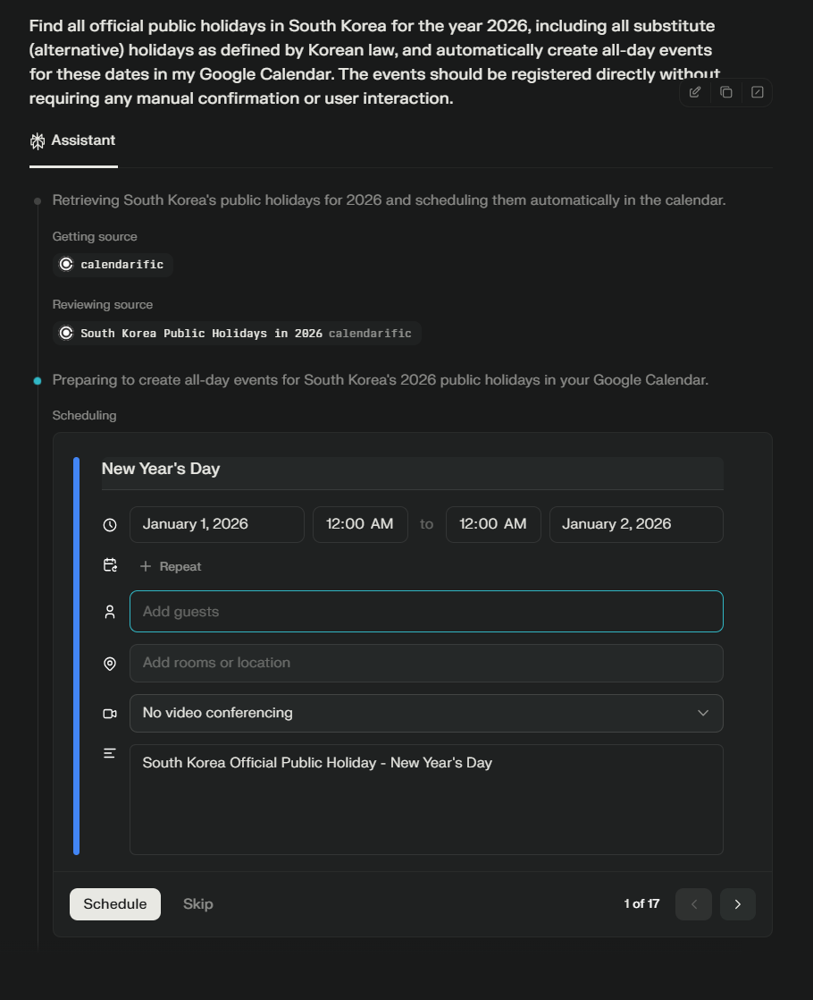
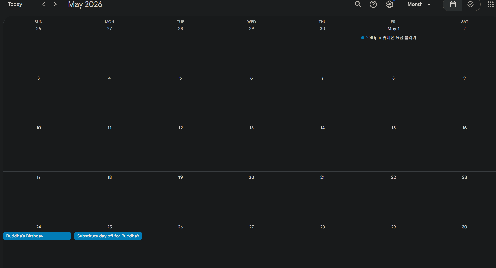
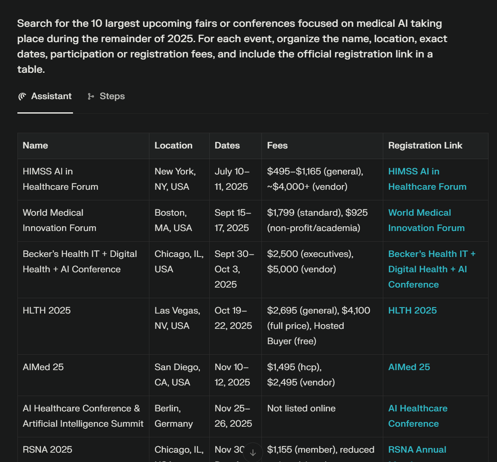
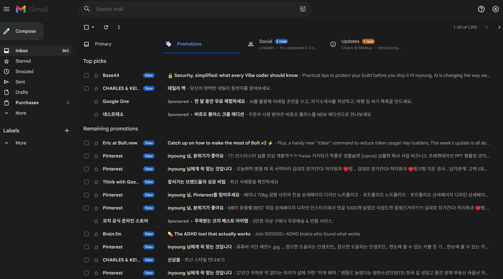
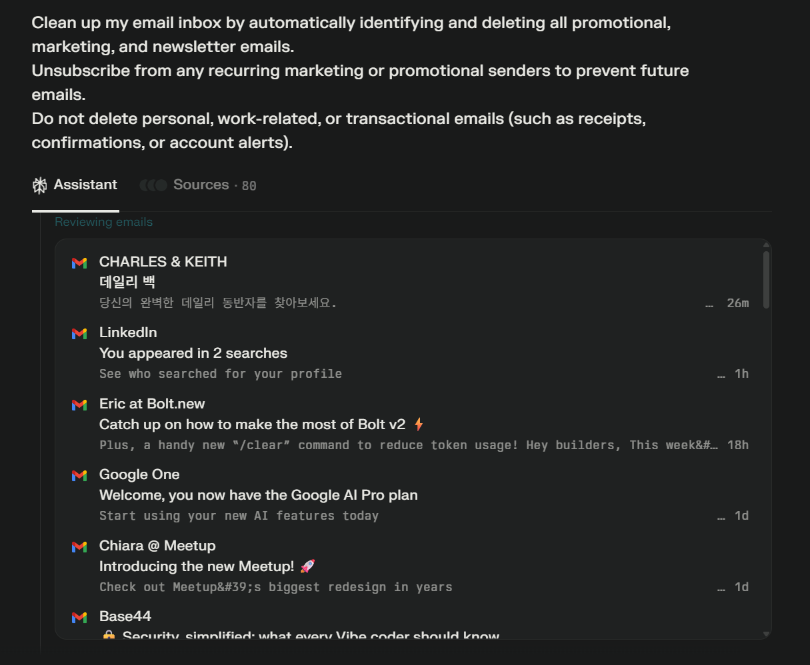

# AI Making Challenge - Day 8

## 💡 Topic : Using the Comet AI Browser

## 🎯 Objective
Comet is a new AI-based browser developed by Perplexity, the company well-known for its AI-powered search service.
I’ve often used Perplexity when I needed to research something, and it’s been quite impressive — especially because it provides valuable information with reliable references.

So, when I heard that Perplexity had released its own AI browser, I was really eager to try it. However, it was initially available only to paid users, so I joined the waitlist and waited patiently. From what I know, millions of users also signed up to try Comet.

Now that Comet is available for free to everyone, I finally got the chance to use it. As someone who has always used Chrome and spends a lot of time searching the web, I want to experience how AI can transform the way I use the internet — enhancing research efficiency, content discovery, and overall productivity beyond what traditional browsers can offer.

## 🤖 AI Tools : [Comet](https://www.perplexity.ai/comet)
Comet is a AI-native browsing model, which redefines the traditional search experience by integrating an answer engine directly with web navigation. Instead of providing a list of links, it allows users to ask questions in natural language and receive a direct, synthesized answer compiled and cited from the best sources. This approach transforms web browsing into a more efficient, conversational process where the AI handles the heavy lifting of finding and summarizing information.

## 📊 Results
### Register korean holidays on Google Calendar
I use Google Calendar to manage my schedule, but I noticed that Korean holidays aren’t automatically registered in it. Because of that, I used to check another calendar to confirm public holidays.

I wanted to add all Korean holidays, including substitute holidays officially designated by the government, directly into my Google Calendar for convenience and accuracy.

So, I asked the Comet browser to find all Korean holidays in 2026 and add them automatically to my calendar.
Unfortunately, it couldn’t register them automatically — I had to manually click the “Add to Calendar” button.

However, Comet did a great job of finding all the holidays accurately, and with just a single click, I was able to add them directly to my Google Calendar.

### Find medical AI conference
When I worked at a medical AI solutions company as a strategic manager, I used to research conferences related to medical AI.

At that time, I would search on Google for phrases like “medical AI conference”, open multiple sites, and manually organize the dates, locations, participation fees, and registration links. It was a time-consuming process that required a lot of effort.

So, I wondered if Comet could handle that task for me.
I asked Comet to find medical AI conferences and organize the information — and it did an excellent job.

The entire process took only about two minutes, which saved me a significant amount of time compared to doing it manually

### Clean Up Gmail Inbox
I heard that the Comet browser can manage your Gmail inbox, so I decided to try it out.
I asked Comet to delete unnecessary emails and unsubscribe from promotional marketing emails.

Comet started reviewing my Gmail inbox, but unfortunately, it couldn’t complete the task due to Gmail’s security policy restrictions.

## 📝 Reflection
In terms of information retrieval, I think Perplexity outperforms other AI services like ChatGPT or Gemini.

That’s why, when it comes to browsers designed for web-based information search, Comet feels exceptionally powerful — it finds useful and relevant information far more effectively.

It significantly reduces the time I spend searching, comparing, and organizing information. At this rate, I’ll probably end up using the Comet browser instead of Chrome in the future.