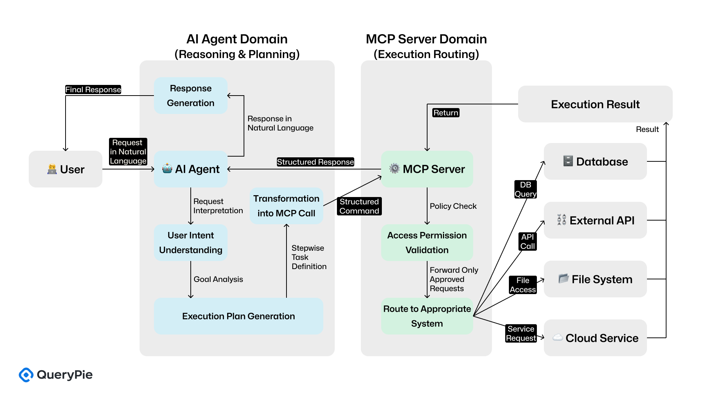
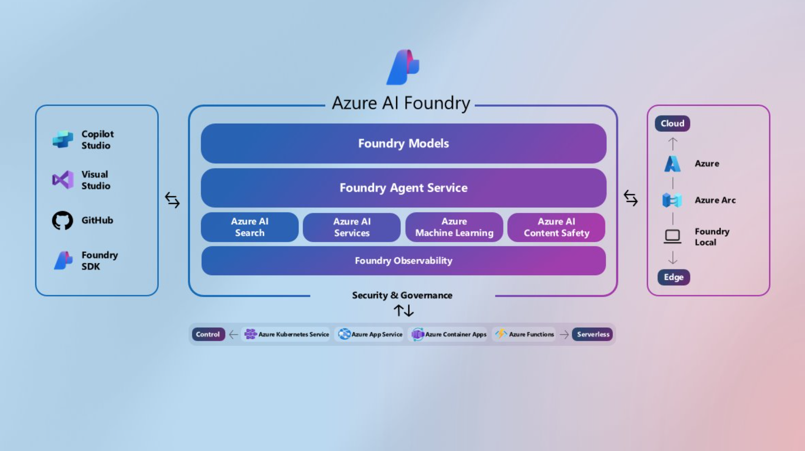
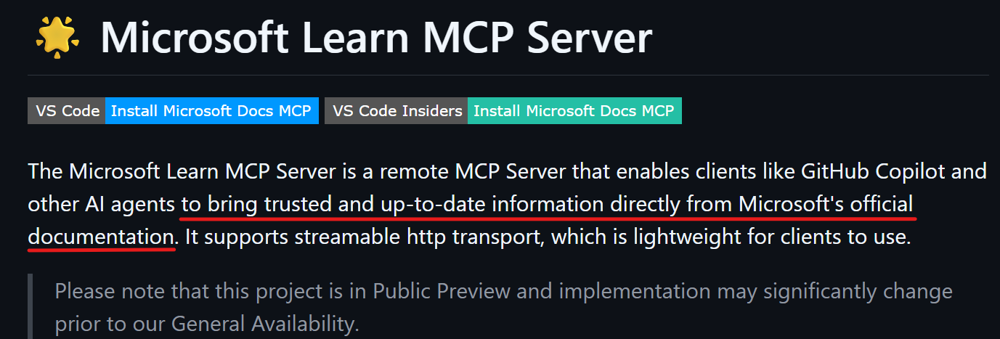
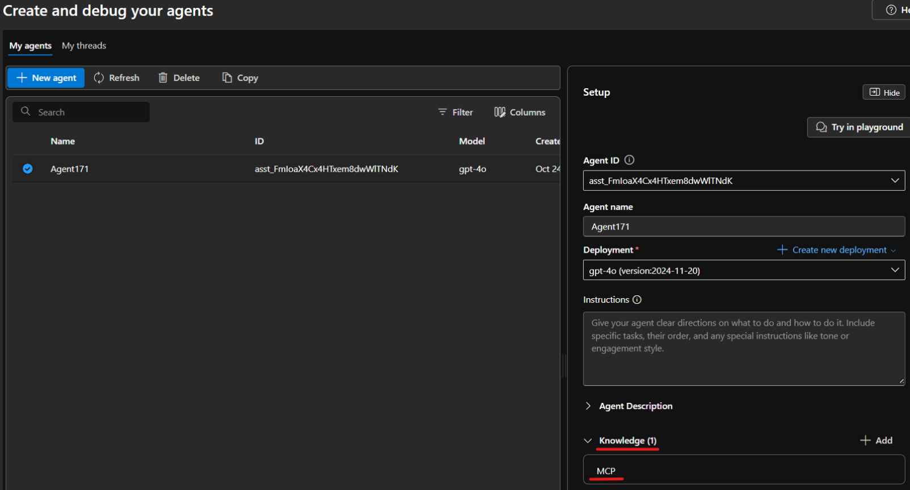

# AI Making Challenge - Day 12

## 💡 Topic : Building AI Agent Using Microsoft Learn MCP Server

## 🎯 Objective
While working as an Azure Cloud Engineer, I often use AI chatbots like ChatGPT and Gemini to ask about customer inquiries, deployment methods, and error resolutions related to resources. However, these AI chatbots often produce hallucinations or provide outdated information. Because of that, I thought it would be great to have a chatbot specializing in Azure that references official Azure Docs to provide reliable answers.

Coincidentally, while watching YouTube, I came across a video titled [Connect Azure AI Agent to Microsoft Learn MCP Server | Step-by-Step Tutorial](https://www.youtube.com/watch?v=1zcpZTQicfk), which shows how to develop an AI Agent integrated with the  [MS Learn MCP Server](https://github.com/microsoftdocs/mcp/). So I decided to follow the tutorial and try developing an Azure AI Agent myself.

## 📚 Background Knowledge
To summarize about the AI Agent and MCP:

- AI Agent 🤖

    Role: Actor

    Definition: An AI system that perceives its surroundings, makes its own decisions, and autonomously takes actions to achieve specific goals.

    Example: An AI assistant that listens to a user’s request and autonomously plans and executes a complex task like “book a flight and add it to my calendar.”

- MCP (Model Context Protocol) 🔌

    Role: Connector / Protocol

    Definition: A standardized protocol that allows AI Agents to communicate seamlessly with various external tools, databases, and APIs (e.g., Notion, Google Calendar, internal databases).

    Analogy: It works like a universal USB port or standard plug for AI Agents.
    
Without MCP, an AI Agent would need to learn and implement separate APIs for each service — for example, Google Calendar’s specific API, Notion’s API, etc. Every new integration would require additional development work.

With MCP, however, once the MCP server is connected to the AI Agent, the agent can easily access external tools, fetch data, and perform actions — without needing separate integrations or custom development for each service.

## 🤖 AI Tools : [Azure AI Foundry](https://ai.azure.com)
Azure AI Foundry is Microsoft's unified, enterprise grade platform for building, deploying, and managing generative AI applications and agents. You can build, customize, and securely manage powerful, task-automating AI agents using a wide variety of models.

## 📊 Results
I created an AI Agent with the gpt-4o model in Azure AI Foundry.

When I asked the question, “Until when can I use default outbound access in Azure?” without any additional configuration, it provided an incorrect answer based on data from October 2023.
 

I connected the Microsoft Learn MCP Server, which allows AI agents to retrieve up-to-date information directly from Microsoft's official documentation

by running [attach_learn_mcp_tool.py](source-code/Azure-AI-Agent-Remote-MCP-main/attach_learn_mcp_tool.py)

Following integration, I checked the AI Foundry Playground and confirmed that the MCP was added to the 'Knowledge' section.

So, I asked the chatbot again, "Until when can I use default outbound access in Azure?".

And it successfully answered with the correct date: March 31, 2026.
 

## 📝 Reflection
The way this AI agent references Microsoft Learn to answer questions is identical to my own workflow as an Azure Cloud Engineer.

It seems inevitable that in the near future, an AI that can acquire and process vastly more information far more quickly than I can will compeletely replace my job role.

To survive in this age of AI, I need to seriously reflect on what kind of skills I must develop.