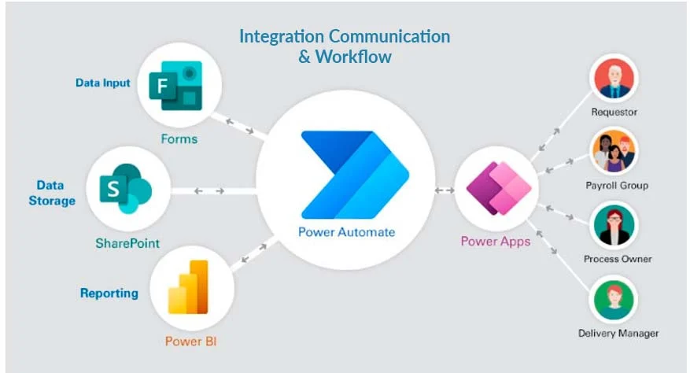
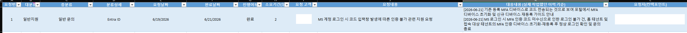
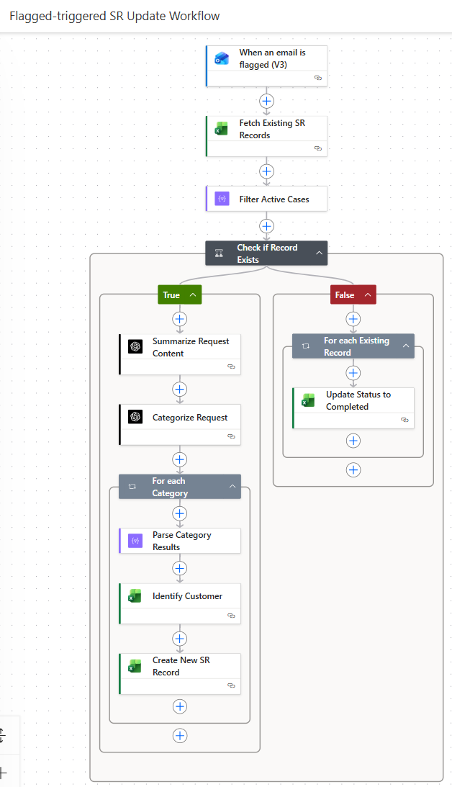
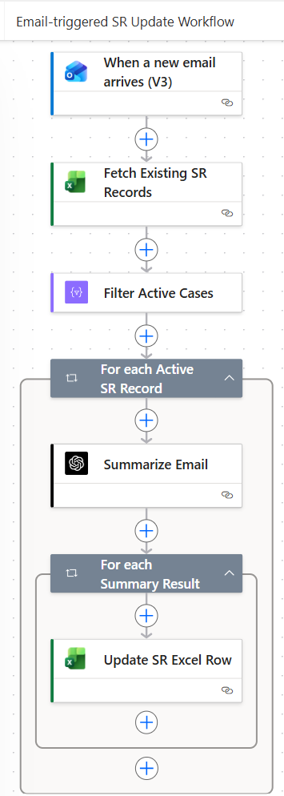

# AI Making Challenge - Day 13

## 💡 Topic: From Manual SR Logging to Intelligent Automation with Power Automate

## 🎯 Objective

### The Pain Point

**I was manually writing request history in Excel every single day, and it was driving me crazy.**

#### The Excel Nightmare
Our SR tracking spreadsheet had **TONS of columns** to fill:
- Request ID, Request Date, Completion Date
- Status, Customer, Requester, Assigned Staff
- Request Content, **Response History** (the killer)
- Categories (Major/Mid/Detail), Duration...
- And more...

**The worst part?** The "Response History" column. Every single time I sent a response email, I had to:
1. Go back to Excel
2. Find the right row
3. **Manually type out the entire response summary**
4. Add the date
5. Keep appending to the same cell (so it wouldn't overwrite previous responses)

This column would look like:
```
[2026-06-21] NSG port configuration completed
[2026-06-22] Waiting for customer confirmation  
[2026-06-23] Customer confirmed - request resolved
```

### The Realization

**Why am I doing this manually?** This is a perfect use case for automation!

- ✅ Structured data (emails, dates, responses)
- ✅ Repetitive process (same steps every day)
- ✅ Clear business rules (categorization logic)
- ✅ Perfect for AI (text summarization & classification)

### The Solution

I decided to build an **intelligent automation system** using:
- **Power Automate**: To orchestrate the workflow
- **Azure OpenAI**: To summarize & classify requests
- **Excel Online**: As the central database
- **Office 365 Outlook**: As the trigger mechanism

### The Goal

**Transform tedious manual process into intelligent, zero-touch automation**
```
Email arrives
    ↓
I FLAG it → 🤖 Automatically registered
           ├─ AI summarizes request
           ├─ AI classifies (6-tier system)
           ├─ Customer info auto-mapped
           └─ Excel record created

I send response → 🤖 Automatically logged
                 ├─ AI summarizes response
                 └─ Appended to response history

Final completion email
    ↓
I FLAG it → 🤖 Automatically marked complete
           ├─ Status changed to "Done"
           ├─ Completion date recorded
           └─ Duration auto-calculated

Total: Just 2 FLAG actions (6 seconds) + 100% accuracy
```

## 🤖 AI Tools: [Power Automate Cloud Flow](https://make.powerautomate.com/) + [Azure OpenAI](https://azure.microsoft.com/en-us/products/openai)

### 🔵 Power Automate Cloud Flow



- **Seamless Microsoft Integration**: Native connectors with Outlook, Excel, SharePoint, Teams - works perfectly with existing Microsoft 365 environment without extra setup or complex configurations

### 🟠 Azure OpenAI

- **Zero Data Training**: Your business data is NEVER used to train the model - keeping sensitive customer requests, business information completely private and secure
- **Enterprise-Grade Security**: HIPAA & SOC 2 compliant with data residency options - safe to process confidential company data and customer information

## 📊 Results

### Architecture Overview

**Complete SR Lifecycle with 2 Integrated Workflows:**

```
┌─────────────────────────────────────────────────────────────┐
│ PHASE 1: REQUEST REGISTRATION (Flagged-triggered Flow)      │
├─────────────────────────────────────────────────────────────┤

📧 Customer request email arrives
        ↓
👤 I FLAG it
        ↓
🤖 Flagged-triggered Flow RUNS
    ├─ Azure OpenAI: Summarize request
    ├─ Azure OpenAI: 6-tier classification
    ├─ Lookup: Customer info mapping
    └─ Create: New SR record (Status: 진행중)
        ↓
✅ Excel: SR-001 created with full details
        ↓

┌─────────────────────────────────────────────────────────────┐
│ PHASE 2: RESPONSE TRACKING (Email-triggered Flow)           │
├─────────────────────────────────────────────────────────────┤

✉️ I send response email to customer
        ↓
🤖 Email-triggered Flow RUNS (Auto-trigger)
    ├─ Match ConversationID with SR-001
    ├─ Azure OpenAI: Summarize response
    └─ Append: [Date] Summary to response history
        ↓
✅ Excel: SR-001 response history updated
        ↓
(⏰ Repeat: Every response email auto-logs)
        ↓

┌─────────────────────────────────────────────────────────────┐
│ PHASE 3: COMPLETION PROCESSING (Flagged-triggered Flow)     │
├─────────────────────────────────────────────────────────────┤

✉️ Final completion email from customer
        ↓
👤 I FLAG it
        ↓
🤖 Flagged-triggered Flow RUNS
    ├─ Find SR-001 (by ConversationID)
    ├─ Change Status: 진행중 → 완료
    ├─ Record: Completion date
    └─ Calculate: Duration (시작일 - 완료일)
        ↓
✅ Excel: SR-001 marked COMPLETE with metrics
        ↓
📊 Perfect audit trail, zero manual work
```

---

### ✅ Excel Results



**As you can see:**
- ✅ **All columns auto-filled**: Request ID, Date, Status, Customer, Categories, Duration - everything populated automatically
- ✅ **Perfect data integrity**: No manual typos, consistent formatting, complete audit trail
- ✅ **Seamless response history**: Each response automatically appended with [Date] prefix, maintaining chronological order
- ✅ **Zero manual work**: This entire table was created and updated without a single manual Excel entry

**The Result:** What used to take 30 minutes of daily manual work is now completely automated and error-free.

---

### Visual Workflow Diagrams

#### 🟣 Flagged-triggered SR Update Workflow


**Responsible for:**
- ✅ **Phase 1**: Registering new SR when email is flagged
- ✅ **Phase 3**: Marking SR as complete when final email is flagged
- ✅ Includes: Email flagging → AI summarization → 6-tier classification → Customer mapping → Excel creation/update

---

#### 🔵 Email-triggered SR Update Workflow  


**Responsible for:**
- ✅ **Phase 2**: Auto-logging response history when I send emails
- ✅ Triggered automatically whenever I send a response email
- ✅ Includes: Email detection → ConversationID matching → AI summarization → Excel row update

---

## 📝 Reflection
Even a simple "email to Excel" automation took me about 3 days to implement. I think I'll get faster as I do this more regularly. The key is defining your inputs and outputs clearly upfront—once you know what comes in and what should come out, the implementation almost figures itself out.