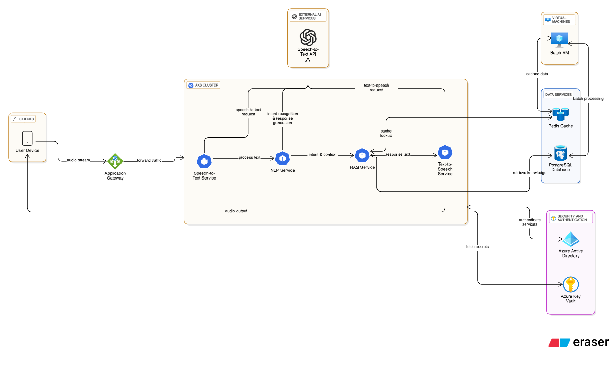

# AI Making Challenge - Day 2

## 💡 Topic : Cloud Architecture Design with eraser.ai

## 🎯 Objective
One of the responsibilities of a cloud engineer is to design cloud architectures for customers. Sometimes this involves illustrating the architecture of an existing service in operation, and other times it requires envisioning and designing the architecture for a new service. Let’s focus on the case of developing a new service.

When a customer wants to build a new service and asks, “We’re planning to create this type of service—how can we implement it?”, the engineer must be able to design an architecture that meets the customer’s needs.

For example, if a customer says, “We want to develop an AI assistant capable of speech recognition—how should we design it?”, the engineer would combine cloud resources such as VMs, Kubernetes, load balancers, and databases to design an architecture and explain it to the customer.

**This raised the question** : could we replace this aspect of the engineer’s work with AI? Specifically, by leveraging AI that generates cloud architectures and diagrams based on natural language, I wanted to explore the possibility of constructing architectures in this way.

## 🤖 AI Tools

## [eraser.ai](https://www.eraser.io/ai)
Eraser.ai is an AI-powered collaborative diagramming and documentation tool.
It enables users to quickly transform natural language descriptions into visual diagrams and structured documentation—including cloud architectures—while leveraging a diagram-as-code approach that makes the outputs editable, versionable, and easy to maintain.

## 📊 Results
I created an Azure cloud architecture for an AI voice assistant service using eraser.ai.
The design was generated through two natural language prompts, and this is the result produced by eraser.ai.

The first architecture was a bit hard to read, so I manually adjusted the layout slightly for better clarity.

## 🛠️ Process
I generated the architecture in two steps using natural language prompts.
To create these prompts, I used ChatGPT to refine and structure my ideas.
The **full prompts** are available here: [View Prompts](sources/prompts)

### Prompt Summary
1. **Initial Prompt**  
   - Request the generation of a cloud architecture on Microsoft Azure for building an AI-based voice assistant.
   - I explicitly specified the following components and infrastructure to be included in the architecture:
        - Components: Speech-to-Text, NLP, RAG, Text-to-Speech
        - Infrastructure: AKS, VMs, Redis Cache, PostgreSQL, Security

2. **Second Prompt (For modification)**  
   - Added Azure Application Gateway in front of AKS  
   - Defined pod-level service communication (STT, NLP, TTS each calling their external AI APIs independently)

## 📝 Reflection
Eraser.ai does not generate architectures accurate enough to be directly put into production. However, when a customer describes the service they want in natural language, it can produce a reference architecture that is useful for communication purposes during client meetings.

In addition to cloud architectures, Eraser.ai can also generate diagrams and flowcharts. This makes it valuable for studying or teaching, as it can turn verbal explanations into clear diagrams. If I ever have the opportunity to give a lecture, I think it would be especially handy for creating diagrams or reference images to include in presentation slides.
