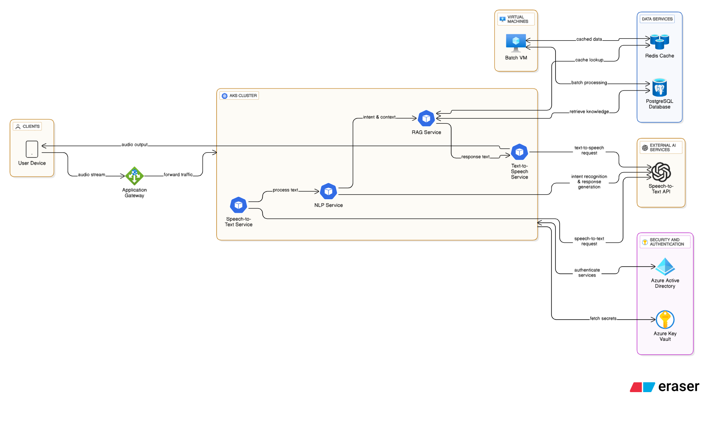

# AI Making Challenge - Day 2

## Topic : Cloud Architecture Design with eraser.ai


## 🎯 Objective

Design and visualize a cloud architecture that meets customer requirements using natural language.

## 🛠️ AI Tools

### [eraser.ai](https://www.eraser.io/ai)
Create cloud architecture diagrams, database diagrams, and more in seconds — simply by describing your requirements in natural language or pasting in some code.


## 📊 Results
I created an Azure cloud architecture for an AI voice assistant service using eraser.ai.
The design was generated through two natural language prompts, and this is the result produced by eraser.ai.


It was a bit hard to read, so I manually adjusted the layout slightly for better clarity.


## 📝 Input Prompts
### Inital Prompt
```
"I am designing an AI-based voice assistant service on Microsoft Azure, and I would like to create a detailed architecture diagram. The service should include the following components and services:

Speech-to-Text: Convert user speech input to text using an external AI model API.

Natural Language Processing (NLP): Process the text to detect user intent and generate appropriate responses.

RAG (Retrieve and Generate) for Response Generation: Use the internal knowledge base to augment the response generation.

Text-to-Speech: Convert the generated text response into speech and output it to the user.

Infrastructure: The service should be deployed on Azure Kubernetes Service (AKS) for containerized application management.

Virtual Machines (VM): Use VMs for handling large-scale batch jobs and processing tasks.

Redis Cache: Implement Redis Cache for faster data processing and response times.

PostgreSQL Database: Store necessary data in a PostgreSQL database.

Security and Authentication: Ensure secure access to services and data, including encryption and access control mechanisms.

Please create an Azure architecture diagram that shows how these components should be connected. The diagram should include the use of AKS, Redis Cache, PostgreSQL, external AI APIs, and other relevant services in a seamless, scalable, and secure design."
```

### Second Prompt for Modification
```
"Please modify the architecture to ensure the following:

Application Gateway: Place an Azure Application Gateway in front of Azure Kubernetes Service (AKS) to handle incoming traffic, load balancing, and ensure scalability and security.

Pod Service Communication: Each pod service (STT, TTS, NLP) deployed in AKS should independently call its respective external AI API. The STT pod should call the AI API for speech-to-text, the NLP pod for intent recognition and response generation, and the TTS pod for text-to-speech conversion."
```