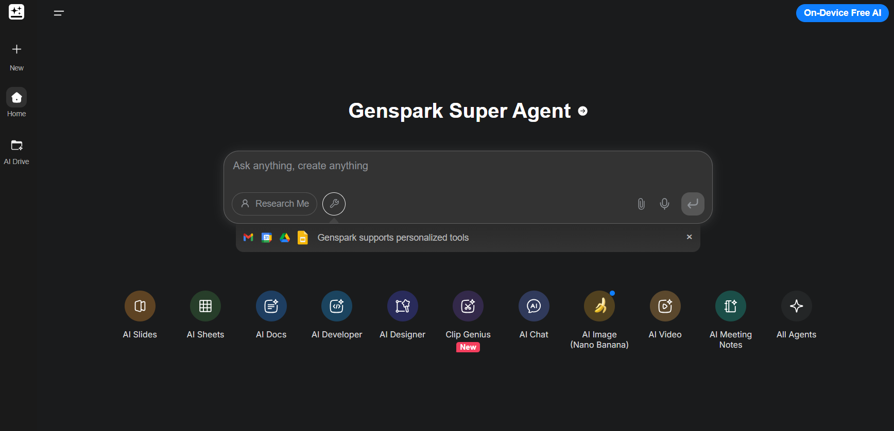
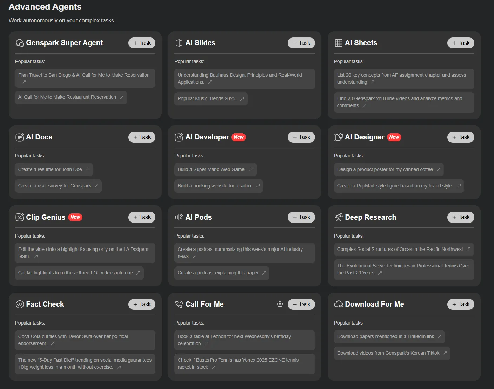
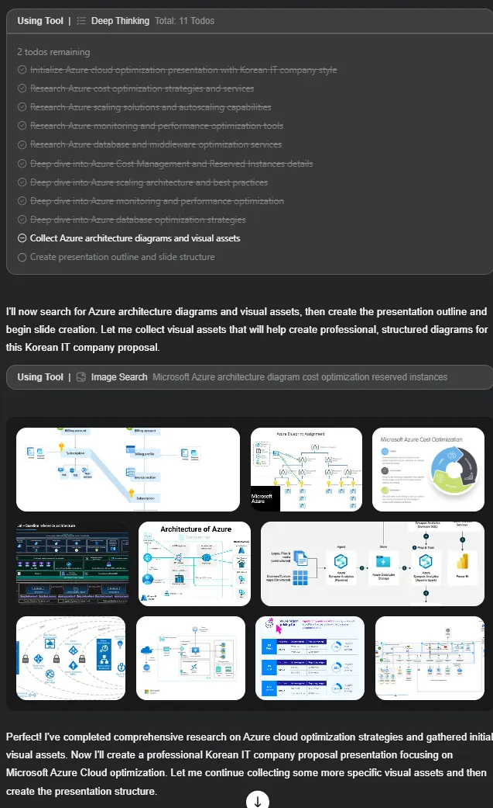
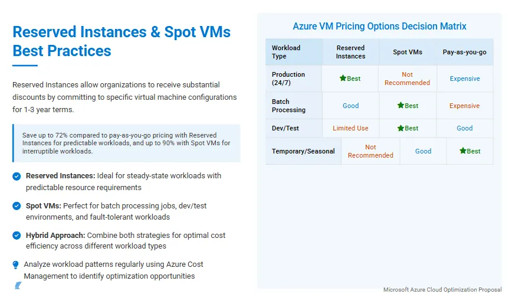
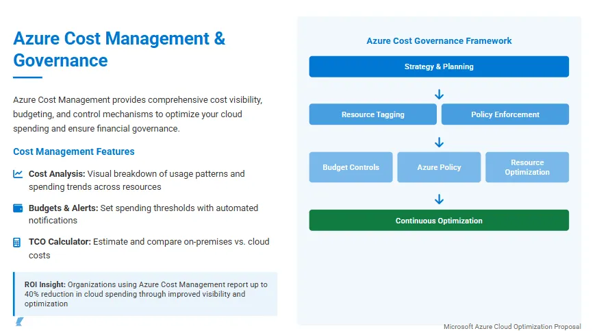
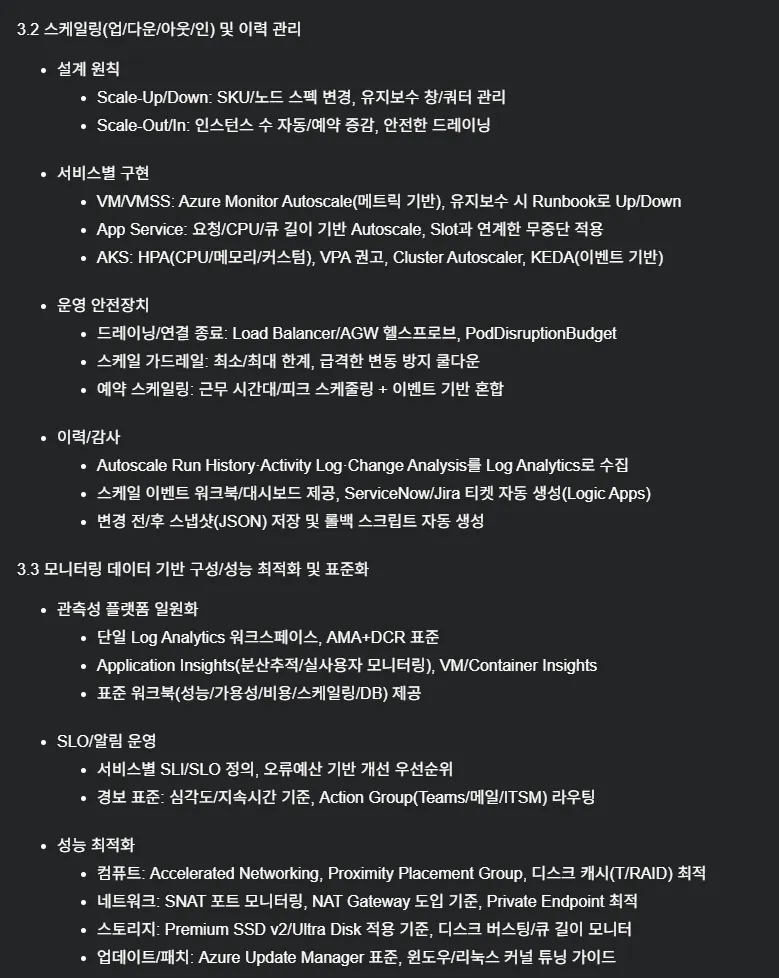
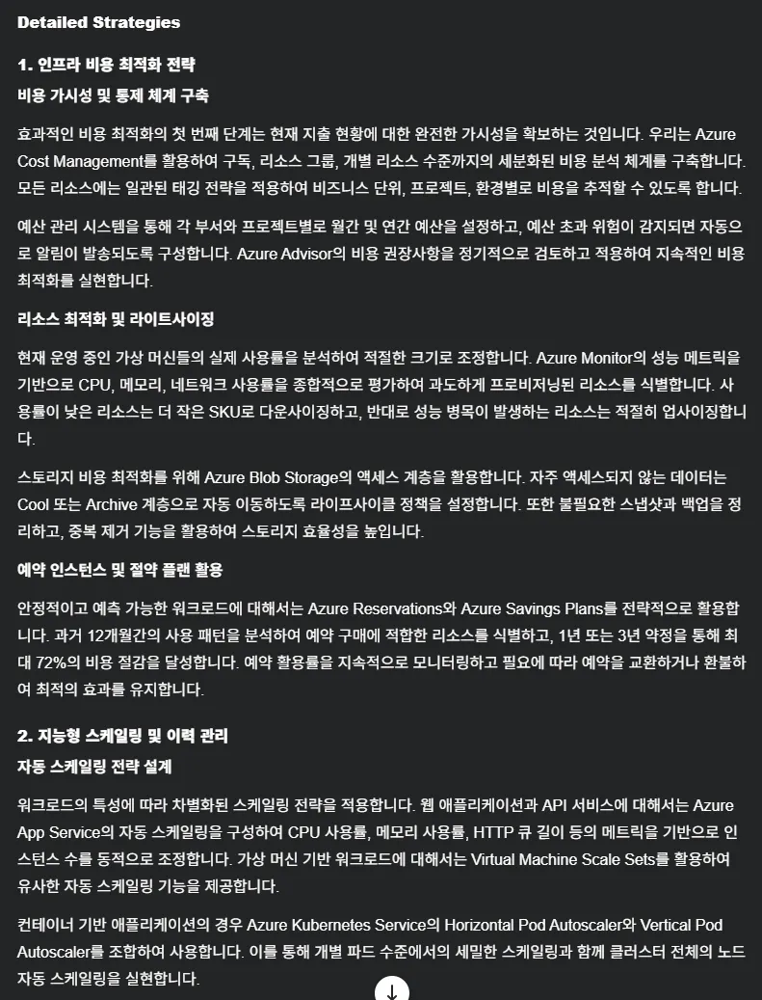
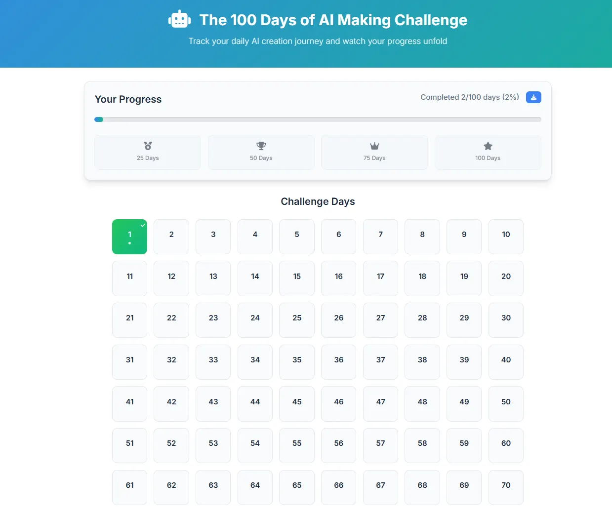

# AI Making Challenge - Day 3

## 💡 Topic : Exploring Genspark - The All-in-One AI Workspace

## 🎯 Objective
With the rise of generative AI, countless AI tools and services have emerged, and I've been actively using many of them. For conversational AI, I use ChatGPT and Claude depending on the purpose. For image generation, I rely on Nano Banana; for reliable, source-based searches, I turn to Perplexity; for coding tasks, I often use Base44 or Claude; and for creating presentations, I prefer Gamma.

However, switching between different platforms for each specific task sometimes feels a bit inconvenient. I’ve always wanted a platform to access multiple AI services in one place. So, when I found out that Genspark provides an all-in-one solution, I decided to test it out.

## 🤖 AI Tools : [Genspark](https://www.genspark.ai/)
Genspark is an all-in-one AI platform that combines chat, coding, content creation, and both image and video generation in one place. Unlike vertical AI tools that specialize in a single function, Genspark unifies multiple capabilities to deliver a more seamless workflow.

AI features available in Genspark

## 📊 Results
I tested only a few of Genspark's various AI features myself. Below are the results and the prompts I used are here: [View Propmts](sources)
### 1. Making a PowerPoint Presentation
Input Prompt Summary (Full: [prompts](sources/ppt-prompts.md))
- Create a PowerPoint proposal for a Korean company about Azure Cloud
- Ensure the proposal
    - Cost optimization
    - Capacity optimization
    - DB/Middlewrare performance optimization

When the task was executed, not only the final output was shown, but also the thinking process in real time. I could see what it was searching for and how it was deriving the results, which I found useful.

Partial final result

The output's style was somewhat different from the typical proposal format used in Korea, so it would be difficult to use as-is. However, if you have no idea at all about how to write such a proposal, it could be worth trying once.

That said, in my case, I think I would use GPT or Claude for generating the content of the proposal, and tools like Nano Banana or Eraser.ai for creating the necessary diagrams.

### 2. AI Chat
In AI Chat Mode, you can use multiple AI models such as GPT-5, Gemini, and Claude.

Since each model has its own strengths, I previously had to switch back and forth between different AI chat services. So, being able to switch models directly within a single platform felt like a nice advantage.

I tested this by giving the same [input prompt](sources/chat-prompts.md) to GPT-5 Thinking High Model and Claude Sonnet4, asking them to generate content for a proposal.

These are the output each GPT-5 Thinking High and Claude Sonnet4. And, personally I found Claude's response to be better organized and more useful for reference.

- Part of GPT-5’s “Thinking High” output

- Part of GPT-5’s "Claude Sonnet4” output 

### 3. Creating Website
I tried using the same [prompt](sources/coding-prompts.md) I had used in Day 1 to create the Challenge Tracking App with Base44, but this time in Genspark.

Below are the results generated by Genspark.

Since it's a simple site, it seemed to work well, and the design was clean and well-made. Also, there wasn't much difference compared to Base44; all the features worked properly and it was well-built.

## 📝 Reflection

Until now, I had been switching back and forth between various AI services, so having a platform that lets you use multiple functions at once was quite convenient.

Since I've only tested it so far, I haven't checked how Genspark's individual AI services compare in performance to the specialized AI services, or whether there are any shortcomings. But at first glance, it doesn't seem to fall short, and I'm hopeful that I'll be able to use it occasionally.