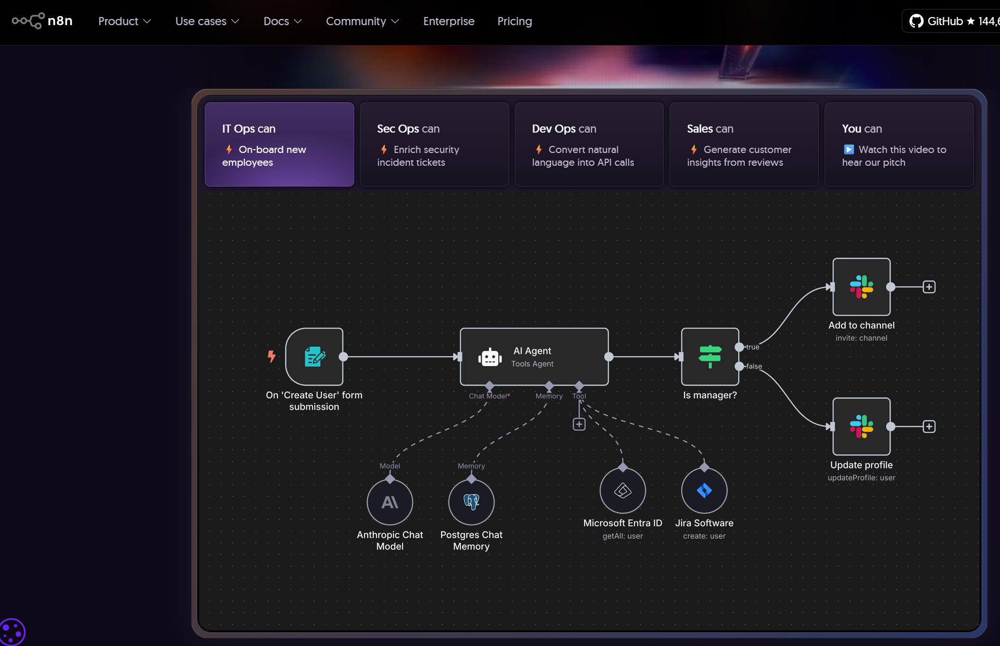

# AI Making Challenge - Day 4

## 💡 Topic : Building an AI agent with n8n

## 🎯 Objective
With the rise of AI and automation tools, I have had several experiences developing workflow-based automation systems. Such tools typically require precise step-by-step instructions from A to Z in order to function correctly. However, if a process changes even slightly, the workflow must be modified, and the lack of flexibility makes it difficult to reuse the same workflow in other tasks.

With the advancement of generative AI, a new concept called the AI Agent has emerged, moving away from the traditional “single input → single output” AI approach. An AI Agent, upon receiving input, can break down tasks into smaller steps, call the necessary tools or APIs, analyze intermediate results, make decisions, and work toward achieving the final goal.

This means that even without highly detailed instructions, an AI Agent can determine the best course of action, ensuring that the automation workflow operates effectively. Inspired by this, I wanted to test whether something similar to Iron Man’s “J.A.R.V.I.S.” assistant could be feasible in practice. To explore this idea, I decided to attempt developing an AI Agent-powered automation workflow using n8n.

## 🤖 AI Tools : [n8n](https://n8n.io/)
n8n is an workflow automation platform. It allows users to connect APIs, databases, and third-party services into automated workflows without needing to wirte a full custom application. Unlike simple ‘trigger-action’ tools, n8n not only supports advanced workflows with branching logic, loops, and custom code, but also leverages AI to build intelligent automations, enabling agent-like behavior that can make decisions and act autonomously.

## 📊 Results

## 📝 Reflection

Until now, I had been switching back and forth between various AI services, so having a platform that lets you use multiple functions at once was quite convenient.

Since I've only tested it so far, I haven't checked how Genspark's individual AI services compare in performance to the specialized AI services, or whether there are any shortcomings. But at first glance, it doesn't seem to fall short, and I'm hopeful that I'll be able to use it occasionally.