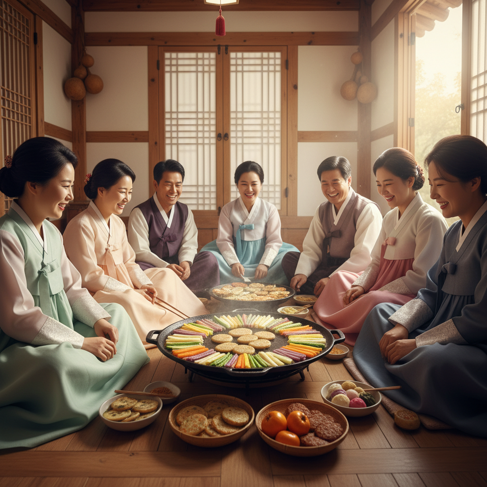

# AI Making Challenge - Day 5

## 💡 Topic : Creating video with veo3

## 🎯 Objective
I remember being truly amazed by the performance of Veo 3, the text- and image-based video generation AI unveiled at Google I/O 2025. The quality was so high that it was almost impossible to tell whether the video was AI-generated or filmed by real people — from the background and human movements to lip-sync accuracy and facial expressions perfectly matching the dialogue.

Since I don’t have the skills to film or edit videos myself, I briefly thought about using an AI tool like Veo 3 to create videos and upload them to YouTube to earn some income. However, not long after that, I read an article announcing that YouTube had banned monetization of AI-generated videos, so I put off trying Veo 3.

Now, as part of my AI making challenge, I’ve decided it’s finally time to try out Veo 3.

## 🤖 AI Tools : [veo3 using Flow](https://labs.google/flow/about)
There are several platforms where Veo3 can be used — such as Gemini, Flow, and Google Cloud. Among them, I chose to test Veo3 using Flow, Google Lab’s AI video generation tool, which allows free access to Veo3 for experimentation.

## 📊 Results
### Text to Video

I generated a video using my own text-based prompt — it’s saved in [prompt.md](sources\prompt.md)

Since it’s Chuseok in Korea as I’m writing this, I asked the AI to create a video showing a family making jeon (Korean savory pancakes) together for the holiday.

I first described the kind of video I wanted to ChatGPT, then asked it to write a customized prompt for Veo3 to generate the video.

For this test, I used the Veo3-Fast model — the most affordable version of Veo3.

The result clearly looked AI-generated, but it wasn’t too unnatural — the video quality was surprisingly decent overall.

### Image to Video
Veo 3 can also take an image as input and generate a video based on that image.

I first created the image using Nano Banana, then used the same prompt as above to generate the video again.

[input image]

[Generated video]

The image-to-video generation turned out generally good, but there were a few awkward parts. When the camera zoomed in, the food in the frying pan suddenly changed.

Also, when I asked the model to add Korean subtitles, it produced strange and incorrect text instead.

## 📝 Reflection
Video generation requires significantly more computing resources, so the usage cost is higher than that of chatbots or image-generation models.
Under the Google AI Pro plan, the monthly subscription is ₩29,000 and includes 1,000 credits.

Each Veo 3 Fast generation consumes 20 credits, while Veo 3 Quality uses 100 credits — meaning you can create only about 10 high-quality videos per month with that plan.

However, for someone like me who has no experience in video production, being able to quickly and easily create demo videos with AI, instead of outsourcing, is a huge advantage.

One thing I keep realizing through this AI challenge is that people who only have moderate skills in their field will eventually lose their jobs.

Since most average-level tasks can now be handled by AI, I need to develop my own sharp, distinctive strengths to stay ahead.
