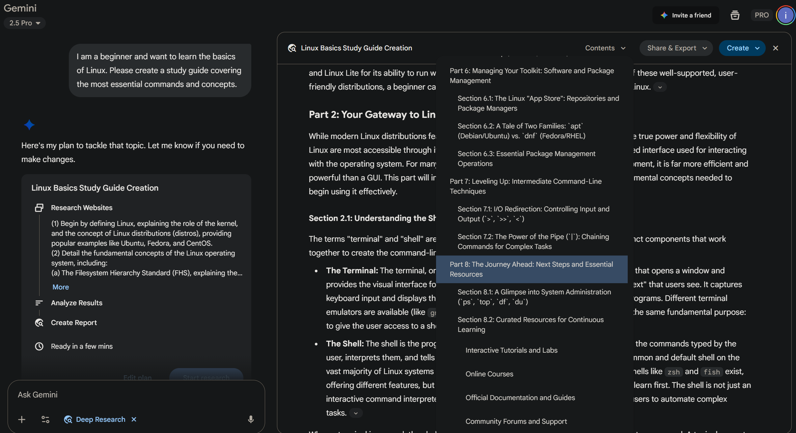
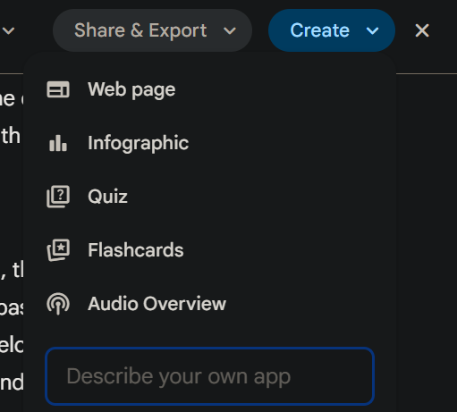
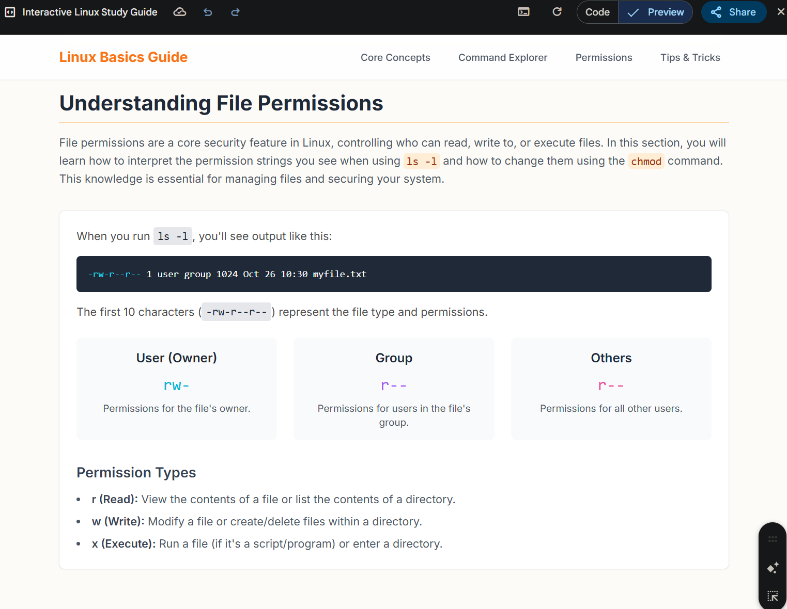
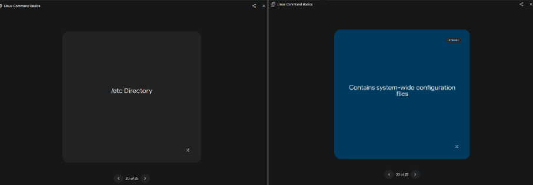
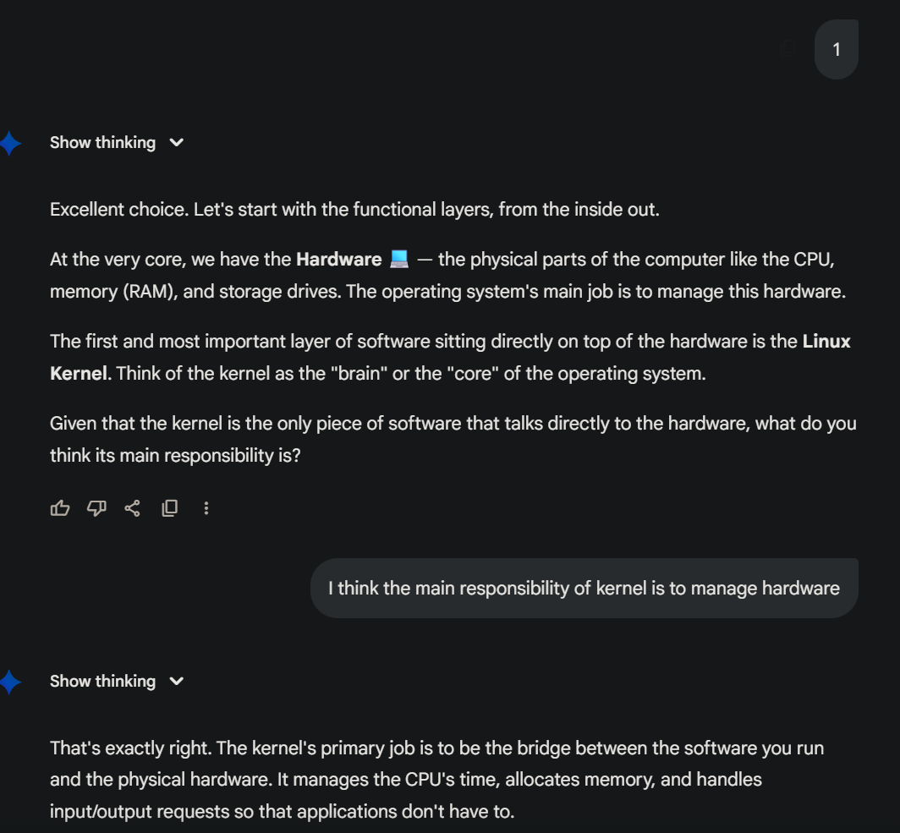
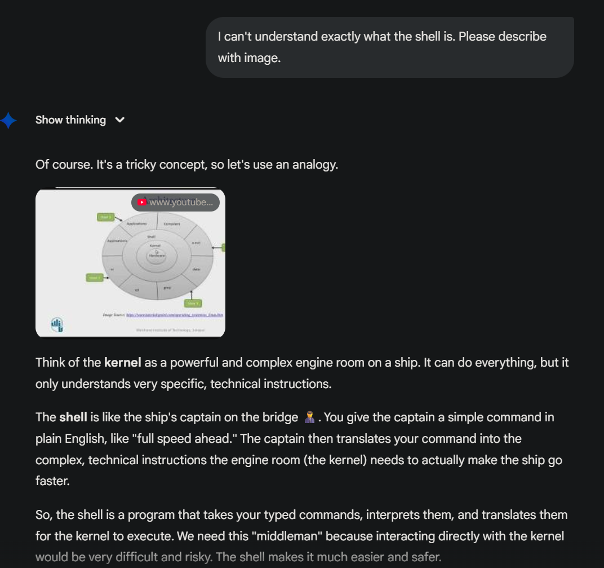

# AI Making Challenge - Day 7

## 💡 Topic : Leveraging Gemini as a Study Aid

## 🎯 Objective
Before starting the 100 Day AI Making Challenge, I mostly used ChatGPT whenever I needed help from AI. Since ChatGPT is the most common and popular tool, I naturally started using it too. As I got used to its UI and how it works, I became comfortable and stuck with it - so I didin't really try other AI tools.

Even during this challenge, I still used ChatGPT to write prompts, even when I was testing other AI tools.

But since this challenge is about exploring AI, I can't just keep using ChatGPT. So for Day7, I decided to try Gemini, which is known for its strong connection with Google Workspace, that's one of its biggest strengths.

## 🤖 AI Tools : [Gemini](https://gemini.google.com)
Gemini is a family of multimodal AI models from Google, natively designed to understand and process a wide range of information including text, images, audio, and video. Compared to other AI solutions that may have started with a text-only focus, Gemini's key differentiators are its inherent multimodality and deep integration with the Google ecosystem, such as Workspace and Google Cloud. This allows for a more seamless and versatile user experience across various Google products and for complex data analysis.

Since Gemini is a multimodal AI, it's a convenient tool for creating audiovisual materials like images, infographics, and podcasts. Therefore, when studying, it can be boring and difficult to understand things with text alone. It seems you could learn in a move diverse and engaging way by using Gemini to create podcasts and summaries.

## 📊 Results
### Deep Research

I'm going to study Linux using 'deep research mode,' so I asked it to create a study guide. It made a detailed guide for me, divided into 8 parts.

This material can also be converted into an infographic, a website, or audio (like a podcast) in the 'create' section, which allows me to learn in various ways with different types of materials."

(website version)

(flashcard version)

### Guided Learning
As a learning assistance feature from Google, Guided Learning is powered by LearnLM, a model fine-tuned for education. Its primary role is to be an interactive learning partner. It moves beyond just answering questions by engaging users in a dynamic learning process. Through a dialogue of questions, answers, and discussions, Gemini guides users to a more profound understanding of the topic.

Here are the results from my test. It checked if I understood, gave me quizzes, and discussed the topic with me to help me learn, instead of just giving the answer

## 📝 Reflection
As someone who doesn't have a long attention span when studying, I found it very appealing that it provides various audio-visual materials and that I can learn through an interactive process of asking and answering questions.

One drawback was that Gemini's response speed was slower compared to ChatGPT. While I haven't done a precise comparison of the answer quality, I didn't get the impression that Gemini's responses were particularly inferior.

Since they say Gemini's integration with Google Workspace is a major advantage, I think I should consider switching from ChatGPT to Gemini as my primary AI service.