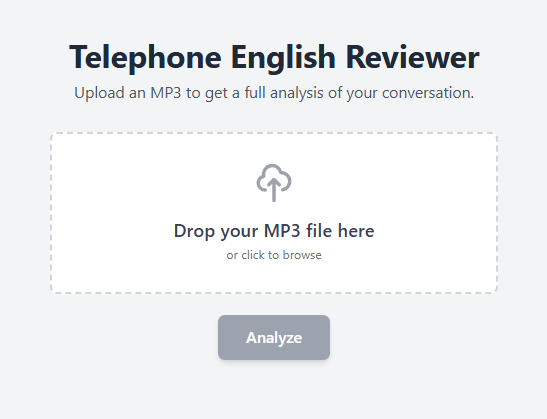
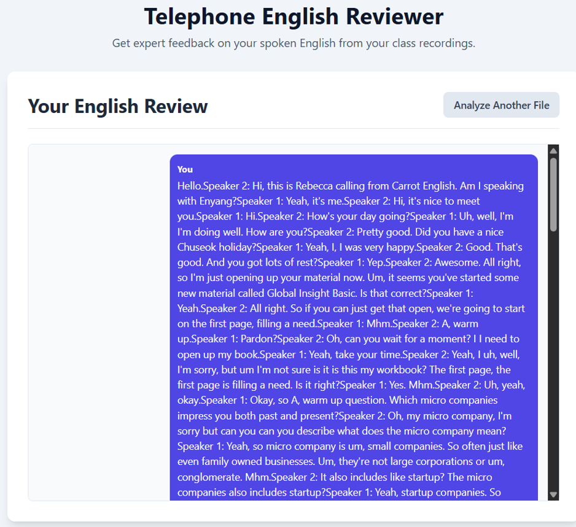
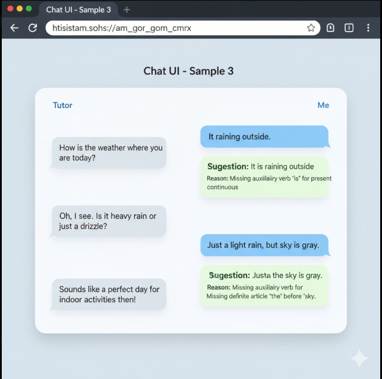
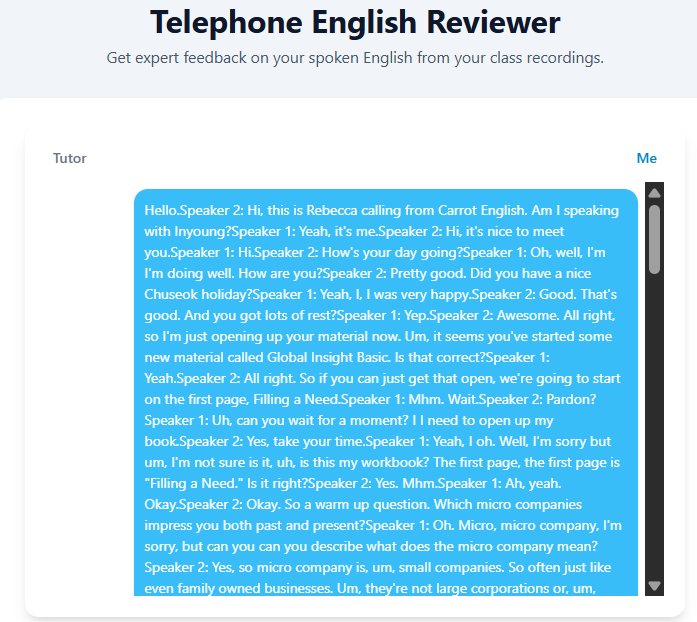
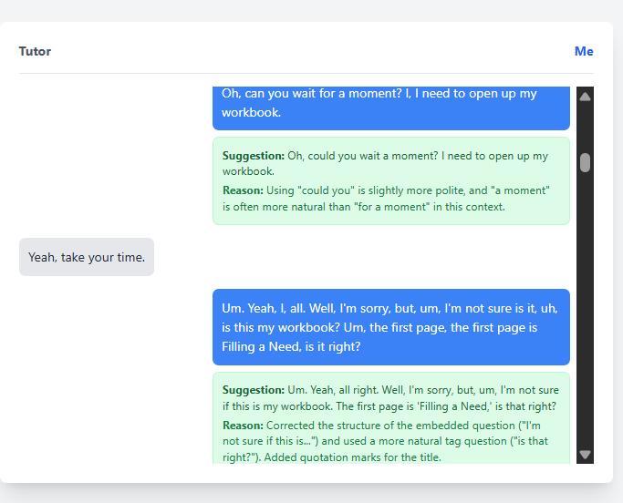

# AI Making Challenge - Day 10

## 💡 Topic : Building a Telephone English Review App with Google AI Studio

## 🎯 Objective
I've been taking telephone English lessons, and after each class, I receive the recorded audio files. To review, I usually listen to them repeatedly to understand the conversation — but it takes a lot of time, especially when some parts are hard to hear. I also want to check whether my grammar and fluency are accurate.

That’s why I decided to create an application to support my English learning. I want an app that can automatically transcribe my recorded conversations when I upload an MP3 file and refine my spoken English to make it sound more natural and fluent. So, I tried to build this app using Google AI Studio through bive coding.

## 🤖 AI Tools : [Google AI Studio - Build](https://aistudio.google.com/)
In Google AI Studion, Build feature empowers developers create generative AI applications by providing access to Google's powerful models through the Gemini API. Essentially, it's a toolkit for developers to build innovative applications and workflows with advanced AI at their core.

## 📊 Results
I'm writing the first prompt to develop the Telephone English Reviewer app using Gemini : [prompt](prompts\prompt-1.md)

The results are shown below. It successfully allows to upload an MP3 file and asks me to identify the speakers. However, the output wasn’t what I expected. The dialogues were displayed as single-line texts, making them difficult to read.

So, I asked [this prompt](prompts/prompt-2.md) to refine the UI into a modern messaging app, with Speaker 1’s sentences in chat bubbles aligned to the left and Speaker 2’s on the right. However, the output remained the same, the dialogues were still displayed as single-line texts.

I created a sample UI image, shown below, using Nanobanana as a reference for refining the UI and provided it along with instructions to update the interface accordingly. Unfortunately, the results remained unchanged.But, the output was still displayed as single-line text.

I realized that refining the UI in the current situation wasn’t possible, so I copied the entire chat history, including my first prompt and all the modification requests I had made throughout the conversation, into a new session. I asked Gemini to start over and rewrote a single comprehensive prompt that included everything from the very beginning, so the app could be rebuilt from scratch according to all my requests. : [prompt](prompts/prompt-3.md)(C:\Users\Metanet\Desktop\LimitlessDevv\100-Day-AI-Making-Challenge\Week2\Day10\prompts\prompt-3.md)

Fortunately, the result was close to what I intended. I can now review all the conversations, and if my English isn’t fluent or contains grammatical errors, the app provides suggestions that I can study and learn from.

## 📝 Reflection
One of the challenging aspects of Vibe coding seems to be that the results are unpredictable. Even when I gave precise instructions in the prompt, the output often didn’t turn out as expected. In the end, it seems the best approach is to continuously tweak and refine the prompt little by little. Since AI cannot develop 100% on its own, once the MVP I want is developed and tested, the finer details still need to be handled by a human.

That said, for someone like me who isn’t very experienced in development, it was amazing that I could build an app — even one with AI functionality — using just natural language prompts, without needing to issue API keys or set up any complex integrations.