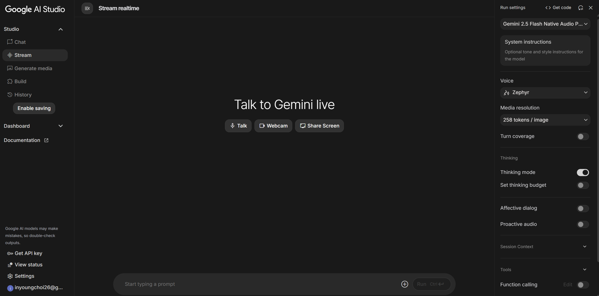
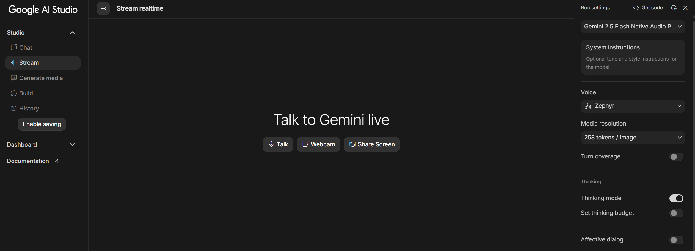
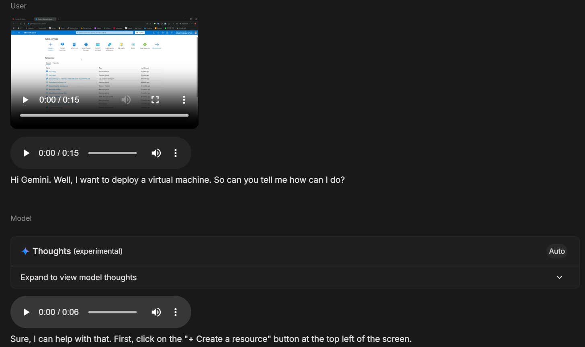
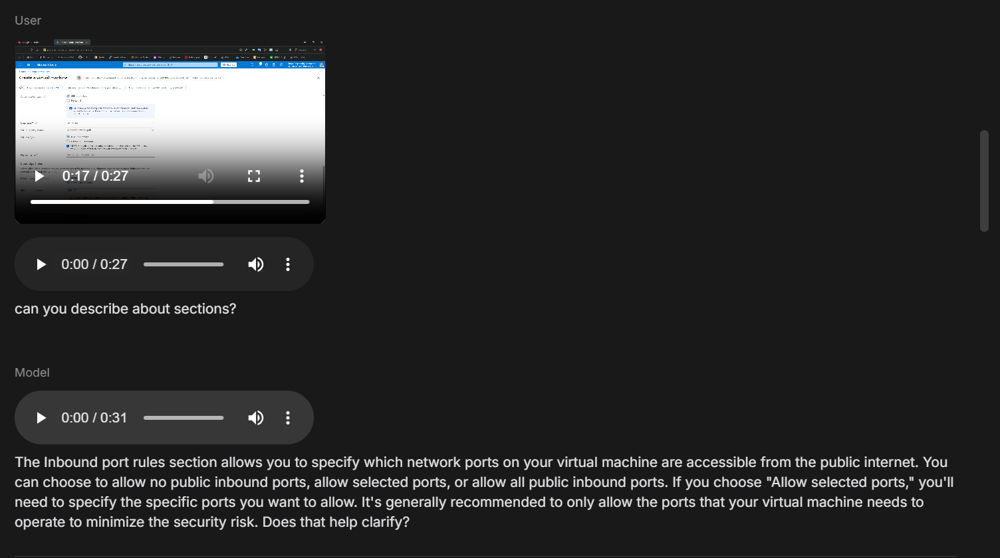

# AI Making Challenge - Day 9

## 💡 Topic : Using Realtime streaming AI in Google AI Studio

## 🎯 Objective
When AI becomes more advanced, I’d love to have a feature that can communicate with me while simultaneously observing my PC screen.
For example, when I’m browsing web pages, writing code, or working in a terminal, I want to be able to ask the AI anything I’m curious about — whether it’s clarifying confusing concepts, translating sentences, or suggesting ways to improve my code.

It would be amazing if I could simply talk to the AI while it sees what I’m doing, without having to copy my work and paste it into another AI service. I’ve always thought it would be great to have an AI that can see my screen, understand the context, and respond to my questions in real time.

In Google AI Studio, there’s a “stream” feature that seems to offer this kind of capability — if I share my screen or webcam, the AI can see what I’m doing and respond based on what it observes. I’m planning to test this stream feature myself to see how it actually works.

## 🤖 AI Tools : [Google AI Studio - Stream](https://aistudio.google.com/)
Google AI Studio is a web-based platform that allows users to try out Google’s AI models and experiment with different prompts.
It provides a control panel on the right side where you can adjust parameters such as temperature, top-p, and more.

You can run multiple input–output tests to fine-tune your prompts, and once the results are satisfactory, You can export the tested configuration as API code, allowing you to use the same model setup directly in your development environment.

The Stream feature in Google AI Studio enables real-time, multimodal interaction with Google’s Gemini models.

Instead of the traditional “send a prompt → wait for a full response” workflow, the Stream feature allows continuous input and output, enabling the model to respond immediately as data comes in. It accepts text, audio, video, and even screen-sharing as input.

## 📊 Results
### Share Screen
I tested the screen sharing feature by opening the Azure Portal and asking Gemini, via voice, how to deploy a virtual machine.

Gemini was able to see and refer to my screen, guiding me exactly which buttons to click.

Later, on the virtual machine deployment page, I asked a few questions about the configuration options, including inbound port rules, and Gemini provided clear and accurate explanations.

## 📝 Reflection
Exploring the real time streaming feature in Google AI Studio was an eye opening experience. The ability to interact with an AI that can see my screen and respond instantly made the process feel much more natural and efficient compared to traditional prompt-based workflows.